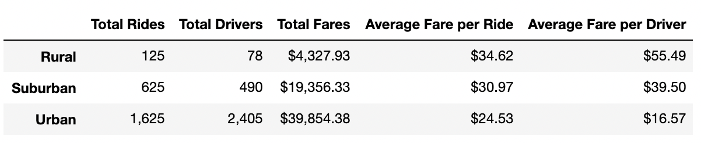
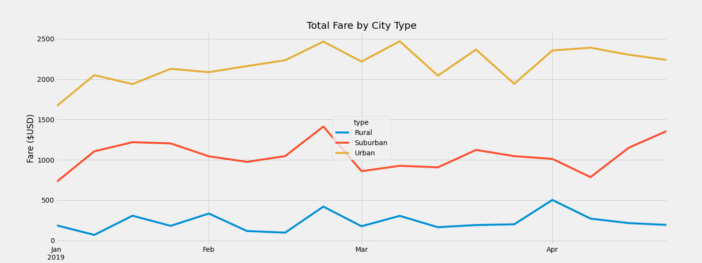

# PyBer_Analysis
matplotlib, pandas, python

## Overview of the Analysis
Pyber, a ride sharing app company, require an analysis to provide a summary table of key-metrics from company data and to visualize the total weekly fares based the city types: Urban, Suburban, Rural. The results from this study will help PyBer, make key decisions on improving the accessability and affordability of their services. 

## Results

After discovering the total number of rides and drivers by city type it is evident that there is a much larger quantity of rides and drivers in Urban cities. Although rural cities charged more per ride, the total fares per city were much larger in suburban and urban areas. Drivers in rural cities earn $55.49 per ride, while suburban drivers earn $39.50 and urban drivers earn $16.57 per ride. It is clear that urban ride sharing is much more common and profitable for Pyber. Urban rides made up 68.4% of the total rides from the 2019 data sets, earning 62.7% of the total fares. The average fares are cheaper in urban cities due to a substantial availability of drivers. Rural areas charge the most due to limited rides and limited drivers. 

The multiple line chart below shows urban cities earning significantly much more money through the months of January through April in the year 2019. Suburban cities have the second highest total fares while rural cities have the lowest. This can be attributed to the opinionthat rural areas are less populated than suburban and urban areas. More people leads to more drivers which leads to more money being spent and earned.  

## Summary

There are ways we can use this analysis to help PyBer take some great steps in the future. The first business idea would be to gather information on the demographics of riders, such as age. With this kind of information PyBer could set up student and senior citizen discounts, for example. A second business idea for rural areas would be to include discounts for larger groups of riders. $34.62 for one ride would turn many people to alternative ways for transportation, making it less expensive for larger groups would increase total fare per ride and decrease total fare per rider. The third and final business idea can be used in all three types of cities but may be more popular in more populated areas: create an account with PyBer which grants members access to rides over limited distances for monthly payments. Consumers avoid paying for each ride and instead can make single monthly payments from home based on their location preferences. 
